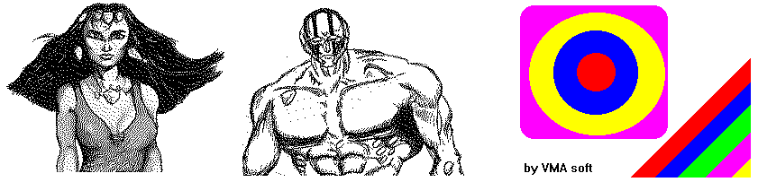

Z80 Tools
=========

Z80 Tools is a collection of DOS based command line tools for assisting with creation of ZX-Spectrum programs.

Contains
--------

- BMP2SCR - Convert .BMP files (BW and Color!!!) to ZX-Spectrum screens with attributes
- SCR2TAP - Convert .SCR files to .TAP files for usage with ZX-Spectrum emulators

Source code can be found in [/src](/src) folder.
To compile the Z80 Tools, use Borland Pascal.

Note: [/book1](book1) and [/book2](book2) contains a tentative to document certain aspects of Z80 CPU and ZX-Spectrum.

